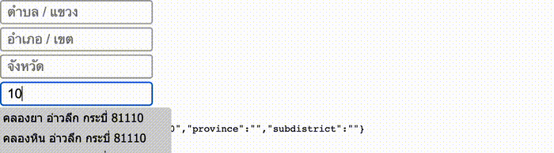

# react-thailand-address-typeahead 
> for v1.0 please refer to `v1.0` branch

> Work In Progress
Reimplementation of jquery Thailand in pure React focus on highly customizable rendering



## Feature
- ✅ Customizable layout
- ✅ Fully customizable CSS
- ✅ Custom datasource option (See [Storybook Custom Option](https://zapkub.github.io/react-thailand-address-v2/?path=/docs/thailand-address-typeahead--custom-datasource-usage#custom-datasource-usage))
- ✅ Keyboard navigation support
- 🚧 Lazy Server Side datasource support
- ️🚧 Form validation support

## Original Idea
[jquery.Thailand.js](https://github.com/earthchie/jquery.Thailand.js)

## Demo
[Example with storybook](http://zapkub.github.io/react-thailand-address-v2)

## Installation
```
$ npm install react react-dom react-thailand-address-typeahead
```
or
```
$ yarn add react react-dom react-thailand-address-typeahead
```

## Usage
see storybook link here https://zapkub.github.io/react-thailand-address-v2

```tsx
import React from 'react'
import {
  ThailandAddressTypeahead,
  ThailandAddressValue,
} from "react-thailand-address-typeahead";
const App = () => {
  const [val, setVal] = React.useState<ThailandAddressValue>(
    ThailandAddressValue.fromDatasourceItem({
      d: "Khongteoy",
      p: "Bangkok",
      po: "10110",
      s: "Khongteoy",
    })
  );
  return (
    <ThailandAddressTypeahead
      value={val}
      onValueChange={(val) => setVal(val)}
      datasouce={customDatasource}
    >
      <ThailandAddressTypeahead.SubdistrictInput placeholder="Tumbon" />
      <ThailandAddressTypeahead.DistrictInput placeholder="Amphoe" />

      {/** you can put any customizable layout like below */}
      <div>
        <ThailandAddressTypeahead.ProvinceInput placeholder="Province" />
        <ThailandAddressTypeahead.PostalCodeInput placeholder="Postal Code" />
      </div>

      <ThailandAddressTypeahead.Suggestion />
      { /** or custom our own suggestion with CustomSuggestion */ }
    </ThailandAddressTypeahead>
  );
};
```

### With Create React App
```tsx
// App.js
import './App.css';
import { ThailandAddressTypeahead, ThailandAddressValue } from 'react-thailand-address-typeahead'
import { useState } from 'react';

function App() {
  const [val ,setVal] = useState(ThailandAddressValue.empty())
  return (
    <div className="App">
      <ThailandAddressTypeahead value={val} onValueChange={(val) => {
        setVal({...val})
      }}>
        <ThailandAddressTypeahead.PostalCodeInput />
        <ThailandAddressTypeahead.Suggestion />
      </ThailandAddressTypeahead>
    </div>
  );
}

export default App;
```


## Original fork and idea 

[earthchie](https://github.com/earthchie/) - Project Owner, Original fork
(you should treat him a beer 😎🍺)
## License
MIT
